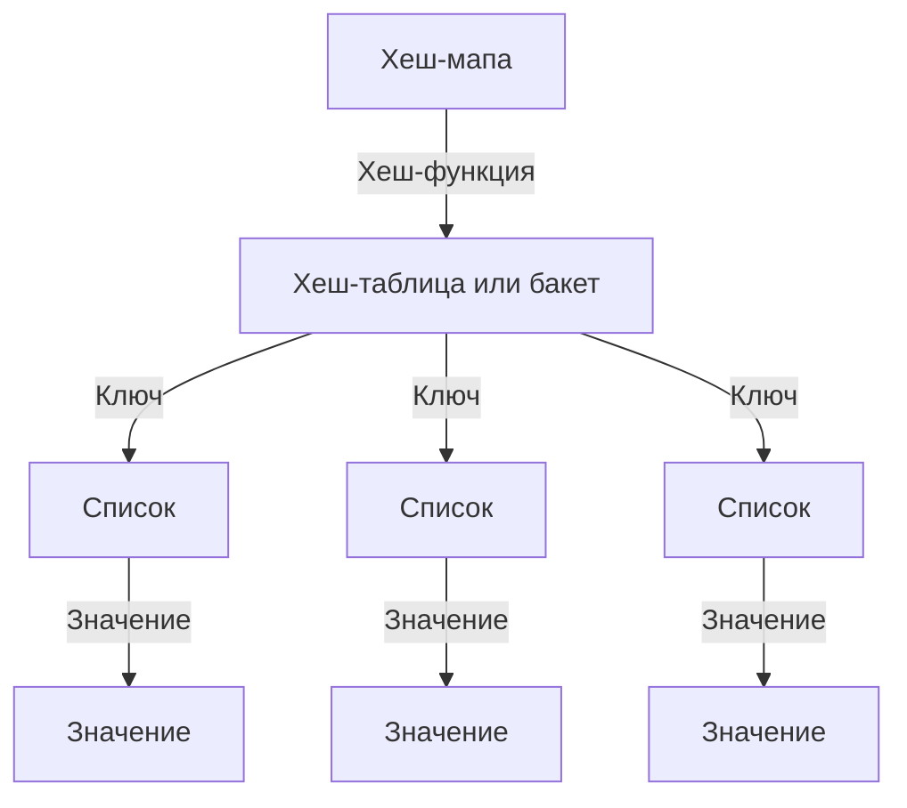

Хеш-мапы в Go, также известные как ассоциативные массивы или словари, это структура данных, которая связывает ключи и значения.

### Инициализация хеш-мапы

Всегда используйте `make` для инициализации хеш-мапы. При записи в `nil` хеш-мапу произойдет паника.

### Операции с хеш-мапами и их сложность

- Добавление элемента в мапу - O(1)
- Удаление элемента из мапы - O(1)
- Получение элемента из мапы - O(1), в худшем случае O(n)
- Проверка наличия элемента в мапе - O(1), в худшем случае O(n)

### Итерация по хеш-мапе

Итерация всегда происходит в случайном порядке.

### Эвакуация хеш-мапы

Рост мапы начинается в двух случаях:
- бакеты в среднем заполнены на больше чем ~80%. В таком случае количество бакетов увеличивается вдвое;
- и частный случай (не закодирован) - количество overflow бакетов примерно равно количеству самих бакетов;

Эвакуация проходит асинхронно.

### Внутреннее устройство хеш-мапы

