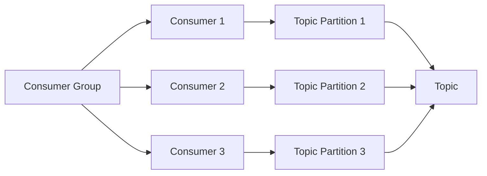

## Что такое Consumer Group в Apache Kafka?

Consumer Group в Apache Kafka - это группа консьюмеров, которые читают данные из топиков. Каждый консьюмер в группе читает данные из отдельной партиции и обрабатывает их. Consumer Group обеспечивает масштабируемость и отказоустойчивость при чтении данных из топиков. Каждый консьюмер в группе читает данные из отдельной партиции, что позволяет распределить нагрузку на кластер. Если один из консьюмеров выходит из строя, другие консьюмеры в группе могут продолжить чтение данных без прерываний.

## Что такое оффсет в Apache Kafka?

Оффсет (offset) в Apache Kafka - это уникальный идентификатор для каждой записи в партиции. Оффсет используется для отслеживания прогресса чтения данных из топиков. Каждый консьюмер в Kafka хранит оффсет для каждой партиции, чтобы знать, какие данные уже были прочитаны. Консьюмеры используют оффсеты для управления прогрессом чтения данных и обеспечения надежности. Если консьюмер выходит из строя или перезапускается, он может продолжить чтение данных с последнего оффсета, который он запомнил.
